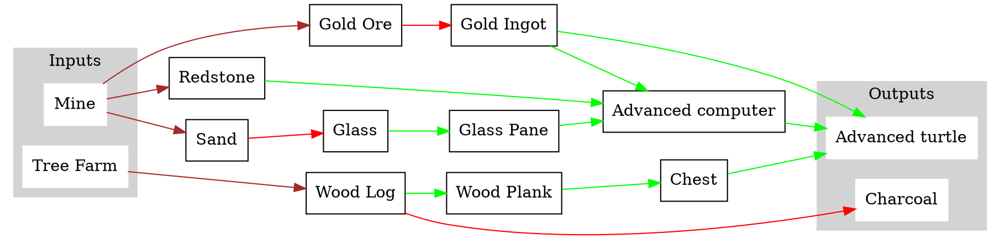

## Ideas for what the turtles can do
* refueling
* fuel rescue (communication!)
* tree farm for fuel
    * plant (+ grow with bonemeal?)
    * chop + deliver
    * smelt
* farming
* breeding animals
* cobblestone generator
* quarry
* build tower / brige
* defending villagers
* hunting in groups

### End goal: self replication
* stone
    * cobblestone
* redstone
* glass
    * sand
* gold
    * gold ore
* chest
    * wood
* fuel
    * wood

* rescuing
    * communication
        * rescue sent
        *
* fuelmaking
* tree-chopping / mining

